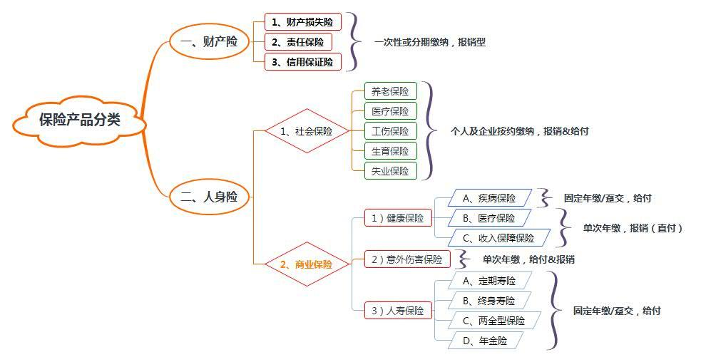
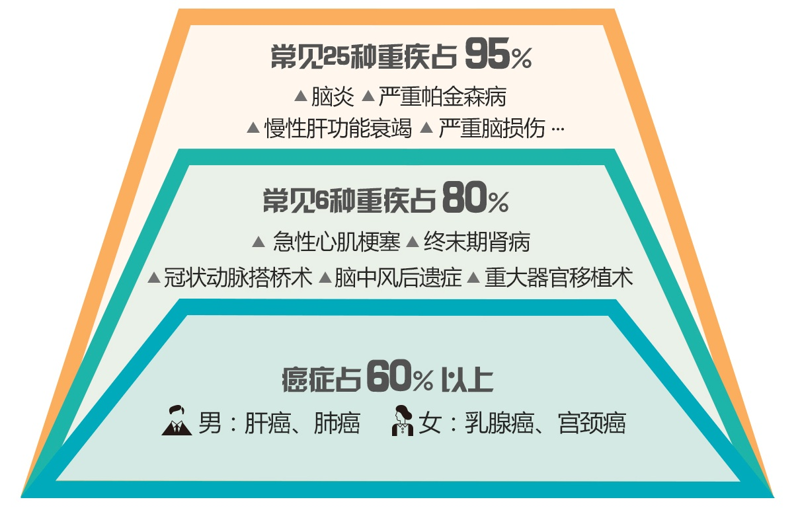
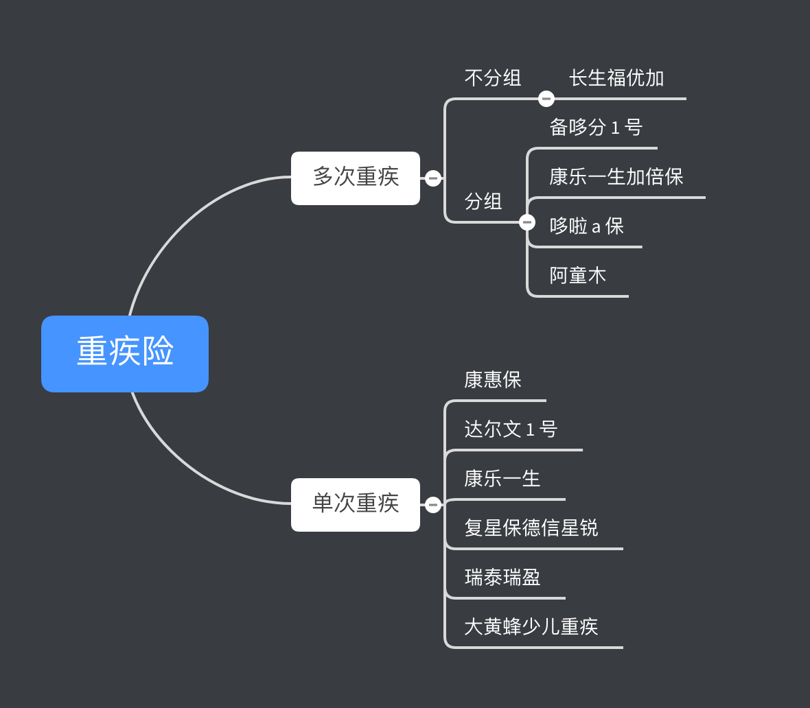

## 1、为什么要买保险？

购买保险是为了减少预期以外的事件对被保险人的财务状况造成冲击，为受益人提供经济补偿减轻负担。**用经济学原理来解释就是被保险人通过缴纳保费换取未来财务状况更大的确定性**。

> 假设没买保险前，你未来财富现值的范围是 [-50 万元，200 万元]，有负值的原因可能是各种财富损失，比如家里大火，比如治病过程中支付的高额医疗费用；而通过购买保险，你的未来财富现值的范围可能变成 [80 万，190 万]，虽然最大值因为要交保费而变小了，但是波动范围更加确定了（这个例子中波动范围从 250 万缩小到 110 万，所以未来更确定了)。

**50w 保额 20 年后很可能就不值钱了，买保险还有意义吗**？

> 买保险其实买的是保障。假设你买一个 50w 保额的重疾险，缴费期为 30 年。然后购买之后缴了1 年就出险了，你立刻就能拿到 **50w**，而且后面的保费都从此不用缴了。如果买的是多次赔付重疾，除了这次出险赔付的疾病外，后面如果得了其他满足赔付条件的其他疾病，还能再次得到赔付。

其实通胀对所有资产类型都有影响。

无论是现金、存款、股票、房产，都或多或少会受到通货膨胀的影响。除非你马上、立刻、当下、就把这钱花了。通货膨胀所带来的保额缩水，确实是一个客观存在的事实，但它是资产整体的变化，而不是保险本身带来的问题。短期内的通货膨胀对我们的影响其实很小，但是保险交完马上有保障（等待期结束之后）。

> **别用看理财产品的眼光，去要求一种风险管理工具。**
>
> **最好的抗通胀工具，是你的赚钱能力。**

**多数人的重疾保障是不足的**。

很多人除了国家强制缴纳的五险之外，没有给自己购买其他保险。而五险并没有保障重疾。可能部分企业为员工投保了员工保险福利计划，也就是商业性团体保险。如果就职所在公司或单位已为员工购买了商业团体保险，可以进一步看一下保障计划组合内是否有提供相关的重疾保障。

但是，公司给员工买的保险，通常都是一年期的短期险，当员工离职之后也就不再保障了。所以，条件允许的情况下，还是自己购买一份长期的保险比较稳妥。

## 2、保险的分类

### 一、财产保险
财产保险，又称产物保险，是以各种财产及其相关利益为保险标的的保险。财产保险是一种社会化的经济补偿制度，其主要目的是补偿投保人或者被保险人的经济损失。

大家比较熟悉的机动车辆保险也称汽车保险或车险，是财产保险的一种， 以车辆本身及第三者责任为保险标的。主要保障因车祸或者自然灾害导致的损失。其保险标的，主要是车辆。

### 二、人身险
人身险，是以人的寿命和身体作为投保标的保险。在中国，人身险又分为社会强制保险和商业保险两大类。

我们日常中常说「五险一金」：
- 「五险」其实就是指「社会保险」，简称社保，包括养老保险、医疗保险、生育保险、工伤保险、失业保险。
- 「一金」指的是住房公积金。

**人寿保险、意外险、重疾险这几个险种是相互补充的关系**。

**买了重疾险就不用买寿险**？**非也**。重疾险的身故责任是和重疾共享保额的。就是说，如果小明患了重疾，然后保险公司就把钱赔给他，身故保障责任就完全终止了。如果小明重疾不治而亡，保险公司就不会赔他身故费用。而且重疾险的治疗费用高昂，如果你买了 30/50 万的保额，钱很容易就花光了，寿险责任则明显不足。

**买了意外险就不用买寿险**？**非也**。举个栗子，意外险一般是不保猝死风险的。猝死的内涵可以概括为 “因病突然死亡”。而意外险是不保因病而伤残和死亡的。所以这个只能在重疾险和寿险里面赔付。相对而言，寿险的范围要广很多。

**买了重疾险就不用买意外险？非也。**举个栗子来说明一下～A 先生购买了一份 100 万保额的重疾险，没购买意外险。在某次驾车过程中，不小心发生了车祸，造成左手中指功能丧失、无名指和食指缺失。不符合保险合同约定的疾病定义，无法获得赔付。

**大部分商业保险主要为以下三种类型**：

1. 给付型：即发生保险事故或符合理赔条件时，保险公司按照合同约定的金额一次性或分固定的多次将保额支付给被保险人。比如重疾险。
2. 报销型/补偿型：即发生保险事故或符合理赔条件时，保险公司将被保险人因为出险事件实际支出或实际损失，将在保额范围内的金额支付给被保险人。类似于二次报销的防癌险。比如二次报销型的医疗保险。
3. 津贴型：主要用于发生保险事故时，被保险人不能参加工作造成的收入损失，以及因为住院治疗产生的必要间接费用等的损失的赔付，一般是按保险合同约定的金额支付。

#### 人身保险的类型

每个国家的保险划分都是不同的。在中国，人身保险是指以人的寿命和身体为保险标的的一种保险，分为三种：寿险、健康险和意外险。

在市面上单独销售的寿险，最长只会保障到 70 周岁。

- 人寿保险：是一种以人的生死为保险对象的保险，是被保险人在保险责任期内生存或死亡，由保险人根据契约规定给付保险金的一种保险。在中国人寿保险的业务范围包括生存保险、死亡保险、两全保险。
- 健康保险：是以非意外伤害而由被保险人本身疾病导致的伤残、死亡为保险条件的保险。
- 意外伤害保险：是以人的身体遭受意外伤害为保险条件的保险。

**什么是长期险和短期险**？

长期险：保险期为一年以上的保险，多数是寿险（包括两全、定期寿险和终身寿险，分红型或非分红型）和健康险中的重疾险

短期险：保险期为一年及以下的保险，多数是意外险（当然现在长期意外险也不少见了）和健康险中的医疗险，因为这些产品理赔经验波动很大，做成短期险方便调整费率或终止销售。

对于人身险，如果有长期产品购买就购买长期的，不推荐购买短期产品，正是因为一般不保证下一年能续保，通常也不保证费率的因素。

**理财型 vs 保障型保险**

理财型保险，顾名思义，是一种理财兼顾保险作用的产品。保费分为两部分，一部分保费用来提供保险保障（例如身故返还等），而另一部分用来投资。

精算师认为，**对于理财型保险，应更多的将其视为理财产品而非保险**，如果需要的是风险保障，那么还是购买传统保障型产品更合适。

通常，理财型保险的保障不足，理财的收益也不高，所以，一般建议如果需要的是风险保障，那么还是购买传统保障型产品更合适。如果需要理财，那么购买专业的理财产品收益率会更加可观。

## 3、重疾

什么是重疾保障？保险产品中的重疾定义是有严格规定的。简单来说根据中国保险监督管理委员会（简称「保监会」）产品监管要求，能冠名重疾产品的保险产品必须按中国保险行业协会与中国医师协会的重疾定义提供以下 6 种保障：**恶性肿瘤、急性心肌梗塞、脑中风后遗症、重大器官移植术或造血干细胞移植术、冠状动脉搭桥术和终末期肾病**。只有保障了这 6 种核心重疾的产品才能被命名为 “XX 重大疾病保险”，这6种重疾已经占到一般人群所有重疾发病的  80%-85%。

重疾险属于给付型的健康险。绝大多数**重疾险按给付方式只分为两种**：

1. **提前给付型**：重大疾病保险金与产品或产品组合里包含的任何身故保险金责任共用保额，也就是身故或重疾哪个先发生就先赔保额，但**只赔付一次**，赔付完之后，保单即终止失效，因此产品价格较额外给付的产品便宜。
2. **额外给付型**：只要发生重疾就给付重大疾病保险金保额，保单继续有效，后续如果身故并且产品或产品组合里有提供身故责任的相关保险，再给付一次身故保险金，很明显由于它有**可能赔付两次**（先重疾一次、身故再赔一次），所以它的价格要比提前给付型产品要贵。

### 3.1 重疾保障的病种数目越大越好吗？

截止 2016 年保监会最新定义的行业标准重大疾病是 25 种，我们可以简称为 **“行标 25 种，必备 6 种”**。这 6+19 种一共 25 种重疾已经占到了所有重疾发生概率的 95%。目前无论保障范围是 80 种重疾，还是 100 种重疾，前 6 种病种各家保险公司定义都是相同的，19 种是如果有，需要跟标准中规定的一致。

**所以，病种数量不代表什么**。对于 99% 的国人来说，遇到行业 25 种重疾之外的其他重疾概率实在是微乎其微。 

### 3.2 什么是重疾分组？？

**经常看到 “重疾分组” 这个词，是什么意思**？

解答：某重疾险分 ABCD 四个组，假设某人得了 B 组中的疾病 B1，保险公司理赔过了，以后只管 ACD 组里的疾病，再得 B 组里的任何疾病都不赔付，这是重疾分组的涵义。分组在本质上是保险公司在回避自己的风险，因为**分组后同一组别只赔付一次**。

对于多次赔付的重疾，直观地看是不分组自然比分组的好，但重疾险不分组意味着保险公司赔付的概率更大、风险更高。所以市面上多次赔付的重疾险，不分组的比较少，价格也很高。

**购买重疾分组的产品应该怎么选**？

1. 癌症（恶性肿瘤）单独分组的好过癌症不单独分组，没有单独分组但同组疾病的数量少或者没有那么高发也是比较好的情况。
2. 分组多、高发疾病越分散越好。

对于重疾多次赔付的产品，我们认为癌症多次赔付 > 重疾不分组 > 重疾分组合理 > 重疾分组不合理，最好的是癌症多次赔付的。

#### 3.2.1分组跟不分组的有什么区别？

其实重疾险中最优的选择是重疾不分组且赔付多次的，比如长生福优加，它是 100 种重疾不分组，最高赔付 2 次的。当然价格也会比较贵，不分组的多次赔付重疾险会比分组的多次赔付重疾险费率要贵很多，要清楚自己的预算。

**长生福优加 > 康乐一生加倍保 > 常青树加倍版 > 弘康多啦 A 保**。
#### 3.2.2分组的选择原则
1、恶性肿瘤最好单独分组，这个最重要。
2、恶性肿瘤、终末期肾病、重大疾器官移植术或造血干细胞移植术，这三类重疾的内在关联性较强，最好可以把它们分配到不同组别。
3、急性心梗后要马上实施冠状动脉搭桥手术，时间间隔非常短，如果分组了，要注意间隔期。

### 3.3赔付多少次的最佳？

其次买重疾险，赔付次数 2~4 次最佳，虽然市面上现在出现了很多可赔付 5 次、6 次，甚至 7 次的重疾险，但这其实是保险公司为了降低赔付率从而做出的选择。

其实重疾赔付 2 次，轻症 3 次基本已经足够了，次数太多并无太大的实质意义。除此之外，赔付间隔 90 天～180 天最佳，1 年间隔期太长，不建议选购。

## 4、中症

中症就是处于轻症和重疾险之间的情况，比轻症严重一点，但是还没有达到重疾的严重程度，但是理赔的金额也比轻症会更多一些。

## 5、轻症

轻症又叫做**轻度重疾**，也就是说这个病也是病，但没有重疾、中症那么严重，不过如果没有得到及时的发现或者治疗，任由其发展，那么很大概率会造成重疾。比如说癌症的前期表现就是原位癌，脑炎后遗症的前期就是脑炎，脑中风后遗症的前期是轻微脑中风等等。

## 6、小保险公司靠谱吗？我买的保单安不安全，最后能不能赔？

在中国如果某个公司要经营保险业务，要卖保单给自然人或企业，根据保险法，**这个公司必须持有保监会批准的保险业务经营许可牌照，并接受偿付能力监管**。**而保险公司牌照是稀缺资源**。据说各种在保监会排队等批牌照的公司目前超过了 100 家。

**从对保险公司偿付能力监管来看，中国是目前世界上保险业监管水平最全面最先进的国家之一**。

中国保险业的偿付能力二代监管规则，业内简称 C-ROSS，是以风险为导向的新一代偿付能力监管规则。具体怎么计算实在太专业了，这里就不展开了。简单来说，根据监管要求和指引，在每季末、每年末保险公司会通过建立详尽的数学模型和压力测试后能确保**自己有能力在 99.5% 的概率下无论发生什么事件都不会倒闭**。

也就是说，在中国买保险不用看公司大小，因为门槛高，监管严，即使真破产了 zf 也会兜底，所以主要看产品的性价比。

一个故事：

> 2008年金融危机的时候，大多数人只知道雷曼兄弟破产，却不知道当时还有一家规模类似的公司也濒临破产的边缘。它就是友邦保险 AIA 的母公司 AIG —— 美国国际集团。
> AIG 从大家熟悉的美亚财险起家，1919 年成立于上海，可以说和中国有着很深的联系。到现在，AIG 旗下的友邦保险 AIA，仍是国内唯一一家独资的外资保险公司。在美国，AIG 也是工商银行最大的包销商。
> 金融危机到来的时候，AIG 也面临了严重的流动性危机。
> 美国政府在对待两家公司的态度上，可以说是天壤之别。一边眼睁睁的看着雷曼兄弟破产，一边就在雷曼破产的第二天，为 AIG 提供了 850 亿美金的贷款，前前后后一共花了 1820 亿美金救援 AIG ，几乎相当于把 AIG 国有化了。（当然，我估计还是美国政府太穷，没钱，救不起两家公司。哈哈哈。）
> 这是美国历史上最大规模的一次政府对企业资金援助的行为。

> 浅层的理解，雷曼兄弟是家投资银行，投资的钱嘛，基本算是闲余资金，投资这件事，本身就是要承担风险的，赔了也只能认命。AIG 公司里躺着美国无数老百姓的养老金，这要是打了水漂，社会稳定都成问题。所以美国政府舍「雷曼」保「AIG」，是为了保持社会稳定，降低动荡的可能性。

> 更深层次的原因，经济学上有一个概念，「大到不能倒」（Too Big to Fail，缩写 TBTF），指当一些规模极大或在产业中具有关键性重要地位的企业濒临破产时，政府不能等闲视之，甚至要不惜投入公帑相救，以避免那些企业倒闭后所掀起的巨大连锁反应造成社会整体更严重的伤害，这种情况称为 「大到不能倒」。
> 不是只大就行，必须是倒闭了会产生对社会经济有巨大影响的系统性风险。

## 7、市面上几款重疾保险产品

按照赔付次数分，重疾保险产品可分为单次和多次。多次赔付的产品中根据分组与否又分为两类。下图中列举了不同类型的重疾险。具体评测请自行 google/baidu :smiley: 。

## 8、其他

**寿险保障期限选择**

个人倾向于选择保 20 年，或者保障到 70 岁。前者是因为保险期间适中，后者是因为到 70 岁，子女差不多成年并工作一段时间经济很可能已经独立，那时候万一有事也不会对子女造成太大影响

**缴费期限的选择**

缴费期限选择，大部分人建议是能缴多长就缴多长，主要原因他们认为是未来很长一段时间国内将会是低利率时代（目前一年期存款利率仅 1.5%，国外美国欧元区日本这些就更低了），而保险产品目前定价利率一般都在 3.5%，这是一个不错的 「收益」。

**等待期：**设置的初衷是为了防止本身患病的人骗保，即所谓 “逆向选择”。但是普通人如果不注意这个时间，可能发生患病无法理赔的情况。一般来说，尽量选择等待期短的产品。
**免责：**很多保险产品的 “陷阱” 会设置在这里。
**豁免：**主要定义了一些可以免交或少交保费的情况。一旦意外发生，豁免条款可以减轻经济负担。

**主险和附加险有什么区别**？

在个险产品范畴，主险通常单件保费较高，能支撑业务开展成本，保费中所含的费用可以打的比较高，可以单独销售。附加险保费通常比较低，如果单独销售不太能支撑业务开展成本，因此通常采用与主险搭售的形式。

**我国保险产品是有命名规则的，大致为：保险公司名称 + 可选的吉庆名字 + 具体保险类型**。

比如复星联合优选重大疾病保险 B 款，

- 「复星」是保险公司的的名称
- 「联合优选」是代表吉庆名字
- 「重大疾病保险 B 款」代表这产品为个人寿险中的终身寿险。

通常保险产品也会取一个群众喜闻乐见的别名，比如「哆啦 A 保」、「阿童木」等等。

##  参考资料与学习资源推荐

- [如何用保险保障自己的一生？](https://www.zhihu.com/question/22316395/answer/100909780?from=profile_answer_card)
- [怎么购买一份合适的重疾险组合？](https://www.zhihu.com/question/20745287/answer/22304813)
- 保监会官方运营的公众教育微信号叫「保监微课堂」
- [为什么人身保险一般分为寿险、健康险、意外险？](https://www.zhihu.com/question/33180934/answer/55997947)

由于本人水平有限，可能出于误解或者笔误难免出错，如果发现有问题或者对文中内容存在疑问请在下面评论区告诉我，谢谢

